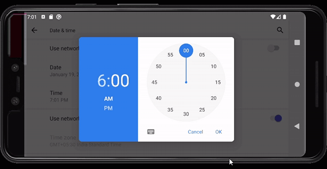
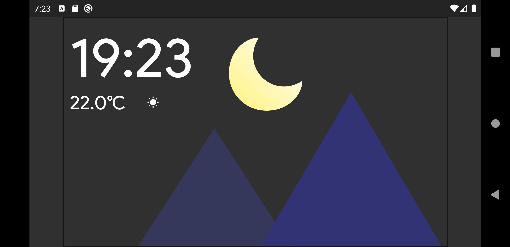
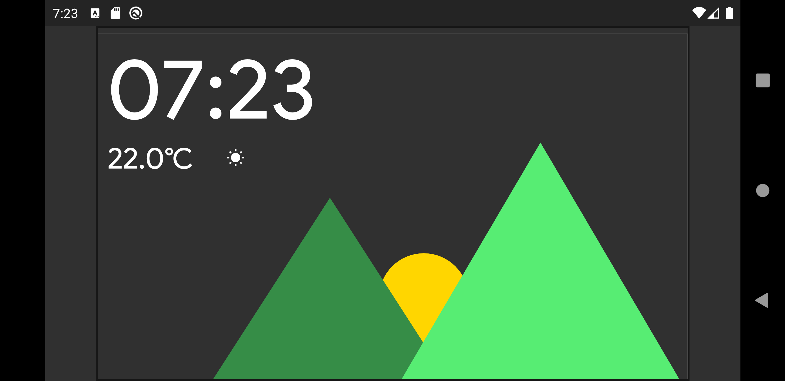
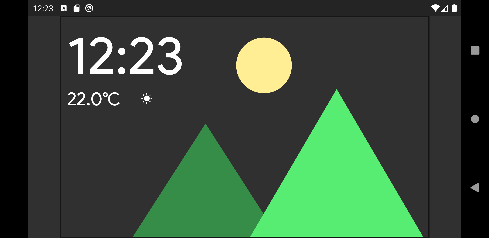

# Digital Clock

## Demo

## Screenshots

### More

This clock is built as a submission to the contest 'Flutter clock' hosted by Google and Lenovo.
The clock changes the background with a smooth animation when the time changes.
The clock changes times when the hour hand reaches any one of the following times -

    6 pm to 5 am (Night time)
    4 pm to 6 pm (Sunset)
    11 pm to 3 pm (Noon)
    6 am to 10 am (Sunrise)

The above gif shows the animations within the app.

The flutter packages used to enable animations are 

    - flare_flutter: ^2.0.1

